# Using XOOPS DebugBar

This tutorial is for XOOPS module and theme developers, site builders, and webmasters who need to understand what a request is doing without adding temporary `echo`, `var_dump()`, or database logging statements throughout the site.

DebugBar combines three views of the same system:

- the browser toolbar explains the page you just loaded;
- Analytics shows patterns across multiple administrator requests;
- Logs and Diagnostics help investigate failures and installation problems.

DebugBar is visible only to authenticated administrators. It is a development and troubleshooting tool, not a public monitoring service.

## 1. Turn on the toolbar

Install and activate the DebugBar module, then open **Administration > DebugBar > Home**.

1. Select **Turn XOOPS Debug ON**.
2. Select **Turn DebugBar toolbar ON**.
3. Open **Preferences** and leave **Display DebugBar** set to **Yes**.
4. Return to the front page while signed in as an administrator.

All four conditions must be true: the module must be active, XOOPS Debug must be on, the DebugBar preference must be on, and the current user must pass XOOPS's site-administrator gate. Module-only administration permission may not be enough for toolbar access.

If the toolbar is still missing, update the module once from the XOOPS module manager. The install/update callback refreshes the browser assets used by PHP DebugBar.

## 2. Start with a low-overhead configuration

The following settings are a practical starting point:

| Preference | Suggested value | Why |
|---|---:|---|
| Display DebugBar | Yes | Enables the administrator toolbar. |
| Enable Smarty Debug | No; Yes temporarily while editing templates | Shows a bounded, sanitized view of final template variables. New installations default to No. |
| Enable Included Files Tab | No | The list can be large and is rarely needed. |
| Slow Query Threshold | `0.05` | Marks queries taking at least 50 ms. |
| Query Logging | Slow & errors only | Keeps the toolbar smaller on query-heavy pages. |
| Enable Ray Integration | No | Enable only when Ray is installed and in use. |
| Store request profiles | Yes | Feeds the Analytics page. |
| Profile retention | 7 days | Keeps enough history for comparisons without indefinite growth. |
| Maximum stored profiles | 10000 | Adds a hard storage limit. |
| Enable Monolog file logging | Yes | Adds structured file logs when Monolog is available. |
| Collect browser web-vitals (RUM beacon) | Yes | Reports LCP, INP, and CLS from real administrator sessions, which is the only way to see slowness the server does not cause. |
| Editor for source links | Whichever editor you use | Makes the `file:line` locations in the toolbar clickable, opening the file at that line. Ignored when `php.ini` sets `xdebug.file_link_format`, which already selects an editor for the whole stack. |
| Collect preload events | No; Yes while chasing a preload or bootstrap problem | Adds the Events tab. Cheap to run, but it is diagnostic detail you only need while looking for it. |
| Collect template resolution | No; Yes while working on themes or overrides | Adds the Templates tab. Turn it on for the one question it answers — which file served which template — then turn it off. |

Set unused performance budgets to `0` to disable those checks. On a busy or production site, turn off XOOPS Debug when the investigation is finished.

The **Bootstrap time budget** uses the measured `XOOPS Boot` lifecycle duration in milliseconds and defaults to `0` (disabled). First observe several representative warm and cold requests, then choose a threshold appropriate to this installation; 100–300 ms can be an illustrative development range, not a universal recommendation. The repeated-query threshold also uses `0` for disabled, while a saved value of `1` is treated as `2`, the minimum meaningful repeat count.

## 3. Read the browser toolbar

Load the page you want to investigate and expand the toolbar at the bottom of the browser. Every collector below is one tab. On a narrow screen the tabs collapse to icons; the tab you are currently viewing keeps its name, so the toolbar always states which collector is open.

The examples in this section all come from one deliberately slow page — a Publisher article that crossed three configured budgets — so that each collector has something to show. Read them together: the point of the toolbar is that twenty collectors describe *the same request* from different angles, and the answer is usually where two of them disagree.

**File locations are clickable throughout.** Wherever a panel shows a `file:line` — a message's source, a deprecation, a query's call site — clicking it opens that file at that line in your editor. Choose which editor under **Editor for source links** in the module preferences; if `php.ini` already sets `xdebug.file_link_format`, that takes precedence and the preference is ignored. This is what turns a finding into an edit, and it pairs with the call-site attribution described under Performance below: that names the line, this takes you to it.

### Messages

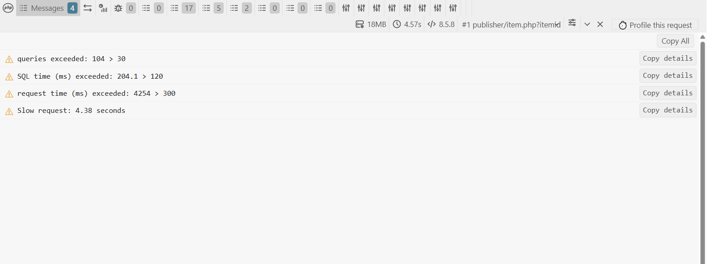

**Shows:** PHP and XOOPS diagnostic messages with severity — warnings, deprecations, caught exceptions, and DebugBar's own budget violations.

**What to do with it:** start here. A page that crosses a budget says so in plain language, with the measured value and the limit it broke. The four lines above are the whole diagnosis in miniature: too many queries, and the SQL is not the reason the request was slow.

Each message expands to its full context:

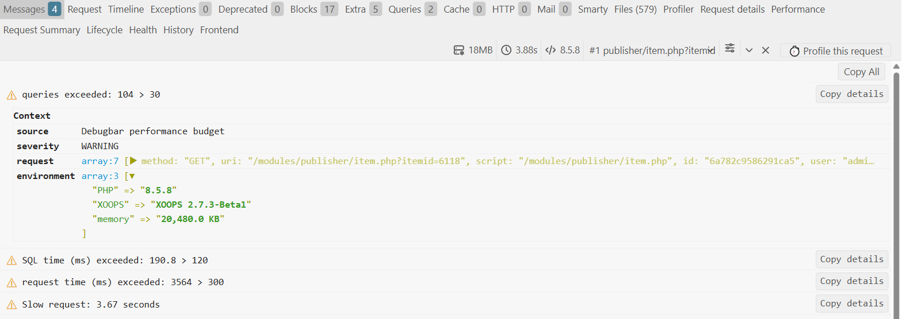

That expansion is what makes a message actionable rather than merely informative — the request that produced it, the environment it ran in, and where the message came from. The **Copy details** button on each row copies it as text for a bug report.

### Timeline

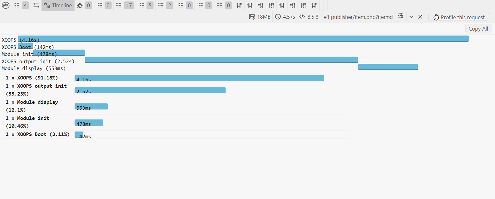

**Shows:** measured phases of the request as bars on a shared scale, then the same measures as percentages.

**What to do with it:** decide *which layer* to investigate before touching any code. In the example, bootstrap is 3.11% and the module's own display is 12.1%, while **XOOPS output init takes 55.23%**. Optimizing the module would be wasted effort — the cost is in theme and output construction. This single reading redirects most performance work.

### Queries

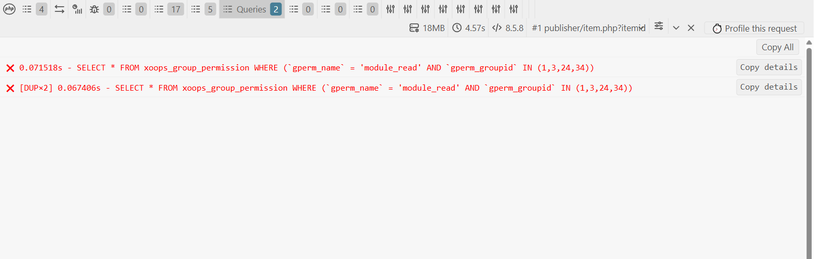

**Shows:** SQL sent through the XOOPS logger, with duration, a `DUP×n` marker on repeated statements, and an **EXPLAIN** action on read-only statements.

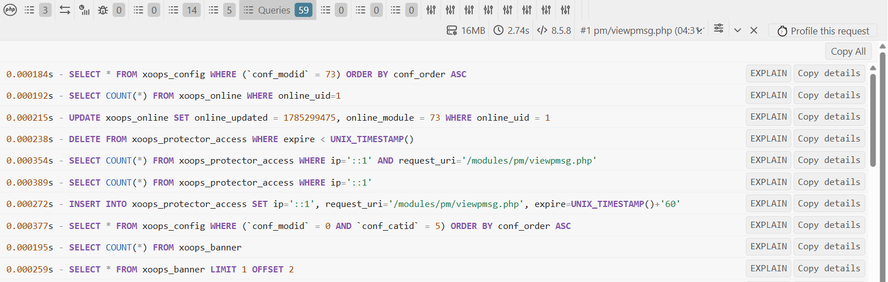

**What to do with it:** find repetition first, slowness second. Note what this panel is *not* telling you: only two rows appear because Query Logging is set to **Slow & errors only**, while Health below reports 108 queries for the same request. Fast queries are still counted and still analysed — they are simply not drawn. Switch to **All queries** for one reload when you need to see them all.

#### Running EXPLAIN on a recorded query

Every read-only `SELECT` row carries an **EXPLAIN** button, which asks the database how it would actually execute that statement.

It takes two clicks. The first arms the button, which changes to **Confirm EXPLAIN?** and disarms itself after four seconds; the second runs it. That deliberate friction exists because EXPLAIN is a real query against a live database, and a mis-click on a query-heavy page should not fire dozens of them.

The plan appears beneath the row's context:

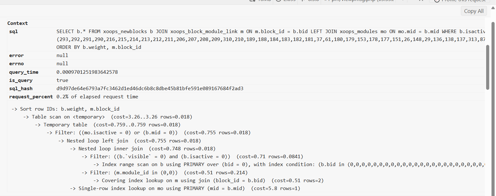

**How to read it.** MySQL 8 and later answer with a tree, read from the inside out — the innermost line runs first and feeds its parent. In the example the innermost step is an `Index range scan on b using PRIMARY`, the results are joined by two nested loops, then a `Temporary table` is materialised and finally sorted by `Sort row IDs`. Each line carries an estimated cost and row count.

**What to look for:** a `Table scan` on a large table means no usable index. `Temporary table` and a `Sort` on a large result mean the database is materialising and sorting rows in memory or on disk, which is usually what a missing index on the `ORDER BY` column produces. Row estimates far larger than what the page needs mean the query is reading much more than it uses. Any of these is a candidate for an index, a narrower `WHERE`, or a `LIMIT`.

**What it is safe from.** The browser never sends SQL to the server. It sends the request id and the `sql_hash` shown in the context — a hash the server itself computed for a statement it recorded during that request — and the endpoint refuses anything that is not a `SELECT` in its own short-lived stash. There is no path from this button to running arbitrary SQL, which is why it can be offered at all. The stashed copy is also redacted: every string literal becomes `''` and every number `0`, so no session id, password or token is ever written to disk.

**When it is not there:** the button appears only when the **On-demand EXPLAIN** preference is enabled and the row is a recorded read-only statement.

### Blocks

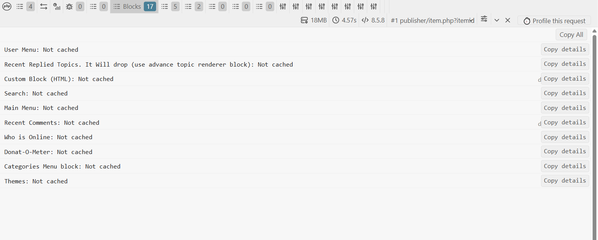

**Shows:** every block rendered for the page and whether it came from cache.

**What to do with it:** this is one of the highest-value collectors on a CMS and the most often ignored. Seventeen blocks, none cached, means seventeen block renders — each with its own queries — repeated on every page view. Blocks whose content changes rarely (menus, categories, "Who is Online") are usually safe to cache, and doing so often removes more request time than any code change.

### Extra

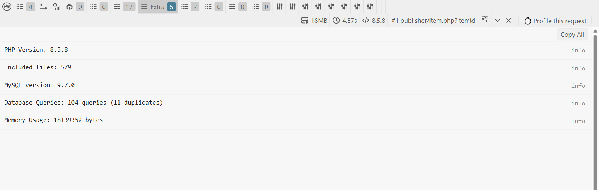

**Shows:** a compact environment and totals summary — PHP and MySQL versions, included file count, total and duplicate query counts, memory.

**What to do with it:** sanity-check the environment you are actually running against before drawing conclusions, and get the true query total independently of what the Queries tab happens to be rendering.

### Request details

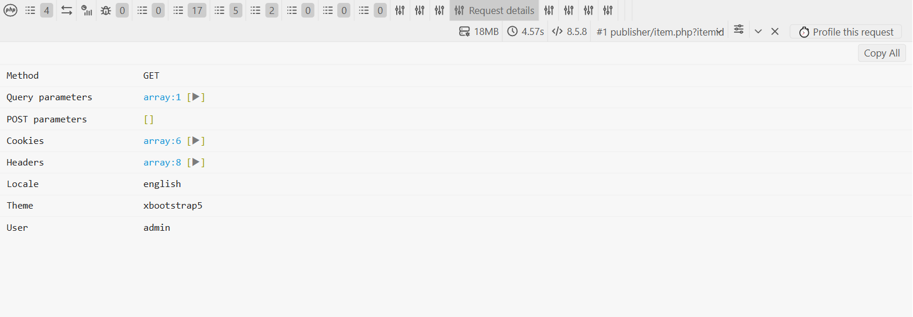

**Shows:** the inputs that produced this response — method, query and POST parameters, cookies, headers, active locale, active theme, and the signed-in user.

**What to do with it:** answer "why did this page behave differently for me?" The theme and locale rows alone resolve a large share of "it looks wrong on my machine" reports. Values are sanitized and the arrays stay collapsed by default, so session and authentication cookies are not printed on screen unless you deliberately open them — bear that in mind before sharing a screenshot.

### Performance

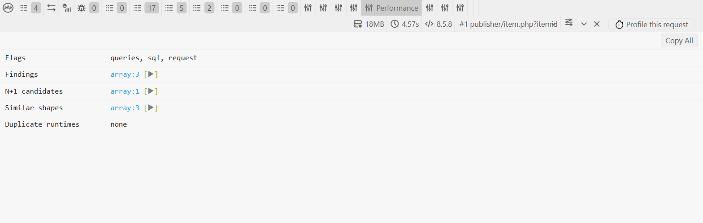

**Shows:** DebugBar's own verdict on the request — which budget flags were raised, the findings behind them, N+1 candidates, similar query shapes, and duplicated JavaScript runtimes.

**What to do with it:** this is the summary the stored profile keeps, so it is also what the Analytics violations feed and the flight recorder will show for this request. `N+1 candidates` lists exact repeats; `Similar shapes` lists parameterized statements with several distinct variants, which is the classic id-loop. `Duplicate runtimes: none` is a real result, not an empty panel — the page was scanned and no library was loaded twice.

**Read the `from` field on every finding.** Each N+1 candidate and similar shape now names the code that issued the statements, as a root-relative `file:line`, with a count when one call site accounts for several of them. That is the difference between knowing a page runs sixty-two identical queries and knowing which handler to open. A real example from a Publisher category page: sixty-two executions attributed to `/modules/publisher/class/ItemHandler.php:255` reached from `:343`, and sixty-one more to `/class/model/stats.php:52` via `CategoryHandler.php:344`. Two call sites, and the whole fault is described.

The frames belonging to the database drivers, the logger, this module and XOOPS's generic persistence layer are dropped, because they are never the answer — the frame you want is the first one in module or kernel code. At most two are kept per statement; a third rarely changes the decision.

**`Time split`** breaks the request into `Boot`, `SQL` and `App`, which is the coarsest useful answer to "where did the time go" and the one that decides what to do next:

- **App** dominant means the time is in PHP that is neither bootstrap nor database. No amount of query tuning will help; go to section 8's "Where is the time going inside PHP?" and profile it.
- **SQL** dominant sends you to the Queries panel and the N+1 findings above.
- **Boot** dominant is a bootstrap problem — usually a preload, which the Events tab will name — and not anything in the module you are looking at.

The same split is emitted as a `Server-Timing` response header (`boot`, `db` with its query count, `app`, `total`), so your browser's own network panel shows the same breakdown without opening the toolbar. That is the one way to read these numbers on a request whose response never renders the bar, such as a redirect or a JSON endpoint.

### Lifecycle

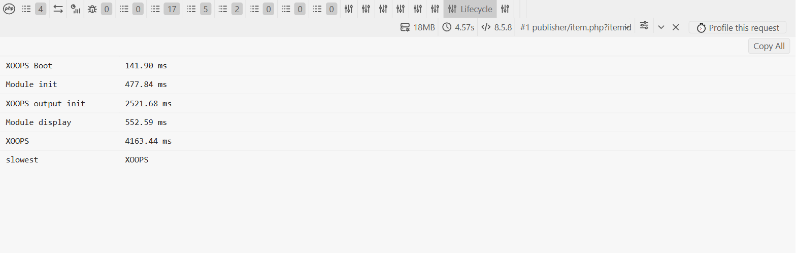

**Shows:** the same phases as the Timeline, as exact figures rather than bars, plus which phase was slowest.

**What to do with it:** use it when you are comparing two runs and need numbers you can subtract. The Timeline is for seeing the shape; Lifecycle is for recording the measurement.

### Health

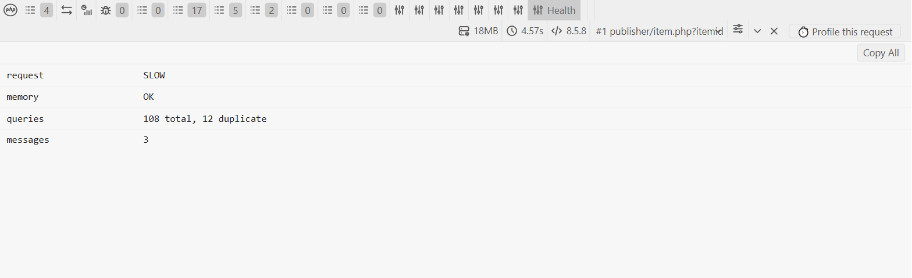

**Shows:** a four-line verdict — was the request slow, was memory acceptable, how many queries ran and how many were duplicates, how many messages were raised.

**What to do with it:** read it first and last. First, because it tells you in one glance whether this request is worth investigating. Last, because it is the honest total: the 108 queries here against the two rows drawn in the Queries tab is the difference between what was *measured* and what was *displayed*.

### Frontend

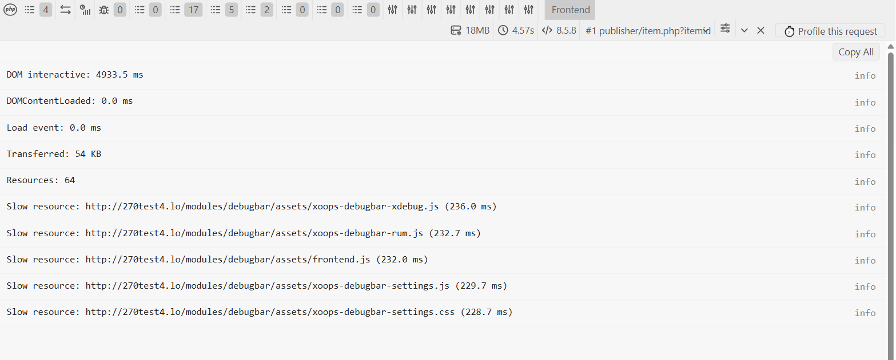

**Shows:** browser-side timings reported back by the page — DOM interactive, DOMContentLoaded, load event, bytes transferred, resource count, and the five slowest resources by name.

**What to do with it:** separate a slow server from a slow page. When the server answered quickly but this panel shows a large DOM-interactive figure, the problem is in the browser and no PHP change will fix it. The named slow resources point straight at the offending files.

### The "Profile this request" button

This one is not a collector — it sits at the right-hand end of the toolbar, beside the memory and timing figures.

**What it does:** it arms a single Xdebug profile capture and reloads the page once. Clicking it posts to `xdebug-arm.php`, which sets a 60-second one-shot trigger cookie server-side — but only after checking that the request is a POST, that the caller passes the same access policy the admin pages use (module admin, XOOPS debug on, module enabled), that a single-use `DEBUGBAR_XDEBUG` token is valid, and that Xdebug is actually configured to accept a trigger. The trigger never travels in the URL, so it cannot be replayed by anyone who later reads it out of browser history, a `Referer` header, or an access log. On the next request the profiler consumes and deletes the cookie whatever the outcome, so an arming can never outlive the one page load it was meant for.

**What you do with the information:** the captured file appears in **Analytics > Xdebug profiles**. Open it and read the top-functions table as described in section 8 — inclusive cost tells you which subsystem is expensive, self cost tells you which function is actually burning CPU. Reach for it when the Timeline says the time is in PHP but not *which* PHP; it is the only view here that goes below the level of "this lifecycle phase was slow".

**If nothing is captured** the toolbar says so rather than failing silently, and **Analytics > Xdebug profiles** states which of `mode`, `start_with_request`, or `output_dir` is unsatisfied. The button is hidden entirely when Xdebug cannot capture a profile at all, and the whole feature is behind the **Show "Profile this request" button** preference.

### Exceptions and Deprecated

**Show:** uncaught and caught exceptions with their traces, and deprecation notices raised during the request.

**What to do with them:** treat Deprecated as an upgrade to-do list. Each entry names an API that still works today and will not after the next major PHP or XOOPS release, with the file and line that calls it. Fixing them while they are notices is far cheaper than fixing them when they become fatals.

### Events

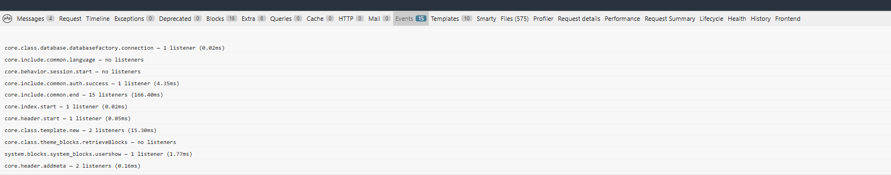

**Shows:** every XOOPS preload event dispatched during the request, in order, with how many listeners each had and how long they took. Events that nothing listened to are listed too, which is the point — from outside, "my hook never ran" and "the event never fired" look identical, and only one of those two is your bug. Enable it with the **Collect preload events** preference; up to 300 dispatches are recorded.

**What to do with it:** preloads are the invisible layer of a XOOPS site. A third-party module hooking an early event can slow or break every page with nothing on screen naming it, and this is the panel that names it.

Read the durations first. In the capture above, `core.include.common.end` carries 15 listeners and 166ms — on a request that spent well under a second in PHP, that one event is most of the bootstrap, and the modules registering those listeners are where to look before touching anything else. Then read the zeroes: if you have written a preload and its event shows *no listeners*, the event is firing and your class is not attached, which is usually a naming mistake rather than a logic one. XOOPS builds the expected class name from the module directory and the preload file name, so an unexpected character in either produces a listener that silently never registers.

### Templates

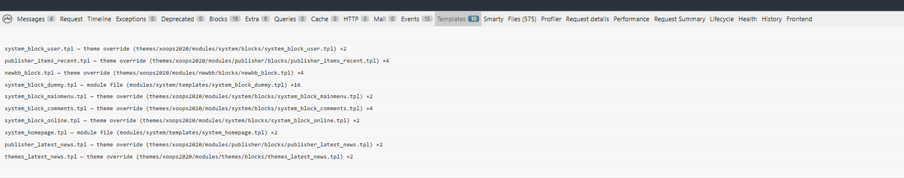

**Shows:** every template rendered for the page, where it was actually served from — theme override, module file, or the database — its path, and a `×n` multiplier when the same template was rendered more than once. Enable it with the **Collect template resolution** preference; up to 300 templates are recorded.

**What to do with it:** settle "is my override actually being used?" without guessing. This is the most common XOOPS support question, and until now the toolbar could not answer it: the Smarty panel below shows the *variables* a template received, not which file supplied the template. If you copied a template into your theme and the page has not changed, this panel tells you in one line whether XOOPS is reading your copy or still reading the module's.

The origin is verified rather than inferred — a file is named only when its size and modification time both match the bytes actually rendered — so a stale copy in the right place is not mistaken for the live one. Where two candidates are genuinely indistinguishable the panel says `ambiguous` and names both, which is a more honest answer than a coin toss.

The multipliers are the second thing to read. In the capture above `system_block_dummy.tpl` renders sixteen times in one request, and `publisher_items_recent.tpl` and `newbb_block.tpl` four times each. Repeated renders are usually repeated blocks, so this pairs directly with the Blocks panel: a template rendered sixteen times with block caching off is sixteen block renders, each with its own queries, on every page view.

### Smarty

**Shows:** the template variables available after rendering, recursively sanitized and bounded by depth, entry count, and string size.

**What to do with it:** confirm the real variable name, type, and structure before editing a template — most "missing content" turns out to be a template reading a variable that was never assigned. Remember XOOPS uses `<{ ... }>` delimiters. Enable this preference only while working on templates: even bounded collection costs time on every request and exposes business data to any administrator.

### Files

**Shows:** every PHP file included during the request.

**What to do with it:** identify which preload, override, library, or compatibility shim actually loaded — the reliable way to answer "is my override even being used?". Large installations load hundreds of files, so enable the preference only when you need it.

### Cache, HTTP, and Mail

**Show:** cache reads, writes, hits and misses; outbound HTTP calls with status and timing; and outgoing mail with recipient, subject and transport — message bodies are removed.

**What to do with them:** an empty one of these means no compatible event was recorded during that request, not that the subsystem was unused. Not every module reports these operations yet, so treat a populated panel as a bonus rather than a guarantee.

### Request Summary, Profiler, History

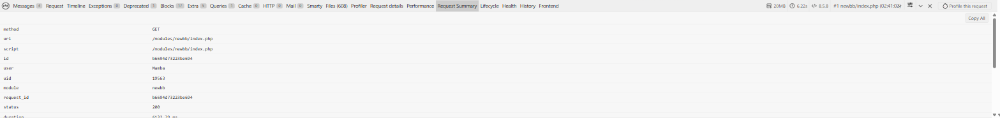

**Request Summary** gives the flat, copyable identity of the request — method, uri, script, request id, user, status, duration. The request id is the value that ties this page view to its stored profile, its flight-recorder dump, and its Monolog entries, so it is the field to quote in a bug report.

**Profiler** exposes DebugBar's own measurements, which is how you confirm the toolbar itself is not what made the page slow.

**History** keeps up to ten small browser-local entries in `localStorage` — path, load time, resource count, no request parameters. It is useful for spotting that a page became slower during your own session, and can be cleared with the browser's site-data controls.
## 4. Use Analytics for patterns, not isolated requests

The toolbar explains one request. **DebugBar > Analytics** aggregates the compact profiles collected while administrators browse with debugging enabled.

Choose a 1-, 7-, or 30-day window and review:

- **Worst offenders** for slow URLs and high query counts;
- the **N+1 leaderboard** for repeated query shapes;
- **Per-module comparison** for average time, queries, payload, violations, and the average **blocks cached / uncached** split per request;
- **Recent budget violations** to see which limit was crossed;
- **Field web vitals** for per-URL LCP, INP, and CLS measured in real administrator sessions, shown beside the server time for the same requests;
- **Flight recorder** records containing bounded request metrics and findings;
- OPcache health, including hit rate, memory, cached scripts, and restarts;
- Xdebug cachegrind files when Xdebug profiling is configured, with a per-file breakdown of the most expensive functions by inclusive and self cost.

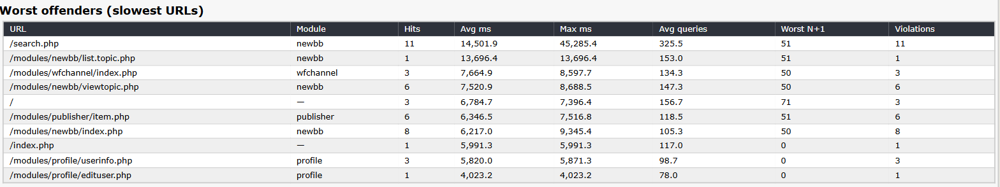

The stored URL is reduced to its path, so query-string secrets are not used as the Analytics identity. Profile storage is bounded by both retention days and maximum row count.

**The blocks column is the one most worth acting on.** The Blocks tab shows the cache split for one request, which cannot tell you whether that request was unusual. This column averages it across the window, per module, so a module reporting `0.0 / 19.0` is rendering nineteen uncached blocks on every view — nineteen block renders, each with its own queries, repeated for every visitor. Blocks whose content changes rarely (menus, categories, "Who is Online") are usually safe to cache, and turning caching on for those routinely removes more request time than any code change. Sort your attention by the uncached figure, not by average milliseconds.

### A useful optimization loop

1. Select a slow URL in Analytics.
2. Reproduce it as an administrator.
3. Inspect total time, SQL time, the slowest queries, and duplicate counts.
4. Change one relevant part of the code or query.
5. Reload the same page with comparable data.
6. Compare the toolbar and the Analytics averages.
7. Add a realistic performance budget to catch regressions.

## 5. Read XOOPS and Monolog logs

Open **DebugBar > Logs** to see the allowlisted XOOPS log files.

- The XOOPS core debug log (logs/debug.log in the configured data directory) is shown as a bounded raw tail.
- Monolog files named `xoops.log` or `xoops-YYYY-MM-DD.log` are parsed into time, level, description, channel, location, and structured details.
- At most the last 256 KB of a selected file is read.
- Parsed Monolog entries are displayed newest first.

Use the log viewer when the failure happened before the toolbar could render, during a redirect, or on a background request. Search for the source location and error number, then expand structured context only when needed.

When enabled, the Monolog adapter is registered for site-wide XOOPS requests, not only requests that can display the administrator toolbar. It writes only events at or above the configured minimum level; at the recommended Warning level, a clean request need not create an entry.

Structured fields are sanitized, but arbitrary preformatted message text cannot be guaranteed secret-free. Logs can contain operational or user-related context, so review and redact any excerpt before sharing it outside the administrator team.

## 6. Run Diagnostics before changing code

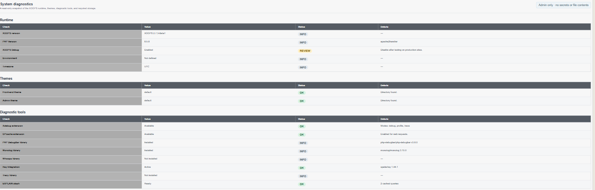

Open **DebugBar > Diagnostics** for a read-only snapshot of:

- XOOPS and PHP versions, debug state, environment, and timezone;
- front-end and admin themes;
- Xdebug and OPcache availability;
- PHP DebugBar, Monolog, Whoops, Ray, and Tracy package status;
- EXPLAIN signing-key readiness and a warning when protected variable data sits below the document root;
- writable log, cache, data, profile, and Smarty compile directories;
- required theme engine and entry files.

Run this page first when a feature is missing. It can reveal a disabled extension, unwritable directory, missing theme entry file, or absent optional package without turning the investigation into a code change.

The EXPLAIN key is stored under `XOOPS_VAR_PATH/data`. When that path is below the web server's document root, retain XOOPS's Apache deny rules and configure an equivalent deny rule for nginx, lighttpd, or any server that does not honor `.htaccess`.

## 7. Capture an Xdebug profile

Xdebug is optional. When its `profile` mode and trigger-based startup are configured, DebugBar can request one cachegrind profile:

1. Enable **Show “Profile this request” button** in Preferences.
2. Open the target page as an administrator.
3. Select **Profile this request** in the toolbar.
4. The button arms a single capture and reloads the page once. The trigger is a short-lived cookie set by the server, never a URL parameter, so the armed request cannot be replayed by anyone who later sees the address in browser history, a `Referer` header, or an access log. It is consumed on the next request whether or not a profile results.
5. Open **Analytics > Xdebug profiles** to find the generated file.

If arming does not produce a file, the toolbar says so rather than failing silently. That normally means Xdebug is loaded but not configured for trigger-based profiling; **Analytics > Xdebug profiles** states which of `mode`, `start_with_request`, and `output_dir` is unsatisfied. The button is hidden entirely when the extension cannot capture a profile at all.

Cachegrind files can become large. Download or inspect what you need, delete individual files, or use **Purge files older than 30 days**. The purge action is token-protected and limited to recognized cachegrind filenames in Xdebug's configured output directory.

## 8. Practical webmaster investigations

Each scenario below starts from a complaint a site owner actually receives, not from a metric. The pattern is the same throughout: use Analytics to decide *which page* to look at, then use the toolbar to understand *that one request*, then change one thing and measure again.

A note on reading budget violations: every stored profile carries a set of flags, shown in **Recent budget violations** and on the flight recorder. The names are `queries`, `sql`, `boot`, `request`, `memory`, `payload`, `n+1`, `fragment-full-theme`, `duplicate-runtime`, and `query-errors`. The first seven fire only when you have set a corresponding budget; the last three always fire when the condition occurs, because none of them is ever intentional.

### “The site became slow after enabling a module”

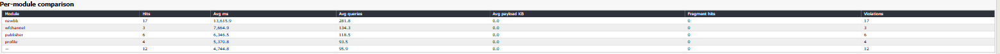

**Decide whether the module is actually responsible.** Open **Analytics > Per-module comparison** over a 7-day window. The comparison shows average time, average queries, average payload, and violation counts per module, so a module that is merely *present* on slow pages is distinguishable from one that is *causing* them. If the suspect module's average request time is close to the site average, the problem is more likely a page that happens to include it.

**Separate the kind of slowness.** Pick the module's worst URL, reproduce it as an administrator, and read two numbers off the request summary: total server time and SQL time.

- SQL time is most of total time → the problem is queries. Continue with “The database server is busy”.
- SQL time is a small fraction of a large total → the time is in PHP, templates, or an outbound call. Open the **Timeline**, and compare the `XOOPS Boot` duration with module display. A large boot figure on every page points at a preload rather than the page itself.
- Both are small but the page still feels slow → the server is fine and the browser is not. Continue with “Fast for me, slow for visitors”.

**Confirm before and after.** Disable the module, reload the same URL with comparable data, and compare. One request is a diagnosis; several comparable requests are evidence.

### “Fast for me, slow for visitors”

This is the scenario server-side timing cannot answer, and the one most often misdiagnosed. The server may genuinely respond in 80 ms while visitors wait several seconds for something useful to appear.

Enable **Collect browser web-vitals (RUM beacon)** in Preferences. The browser then reports Largest Contentful Paint, Interaction to Next Paint, and Cumulative Layout Shift back to the site, and those land beside the server timing for the same request.

Open **Analytics > Field web vitals** and read each row against the server time in the same table:

| Pattern | Reading |
|---|---|
| Server ms low, LCP high | The server is not the problem. Look at images, fonts, render-blocking scripts, and the **Frontend** collector's five slowest resources. |
| Server ms high, LCP high | Fix the server first; the browser is waiting on the response. |
| LCP acceptable, CLS high | Content is moving while it loads — usually images or ads without reserved dimensions. Nothing to do with PHP. |
| LCP acceptable, INP high | The page paints quickly but responds slowly to input, which points at JavaScript on the main thread. |

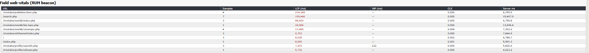

Read the first two rows of that example together. `/modules/publisher/item.php` answers in 6.2 s on the server but records an LCP of 214 s, while `/search.php` answers in 15.4 s and records 199 s. In both cases the server is a small fraction of what the visitor actually waited for, and no amount of query tuning would have found that.

LCP is colored against the usual 2.5 s / 4 s thresholds. Note that these are *field* measurements from real administrator sessions on real connections, which is why they can be far worse than anything you observe locally.

### “A plugin stopped working after I changed themes”

Symptoms are typically a JavaScript widget that silently does nothing, or works on one page and not another.

DebugBar scans the rendered HTML for the same JavaScript runtime loaded more than once — two copies of jQuery, Alpine, htmx, and similar. When it finds one, the request is flagged `duplicate-runtime` and the runtime name and both URLs are reported in the **Performance** panel.

This is worth checking early because the failure is so confusing: the second copy re-initializes the library and discards the plugins the first copy registered, so nothing errors and nothing works. The usual cause is a theme that hard-codes a library the core or another module already provides. The fix is to remove the theme's copy, not to add load-order workarounds.

The scan is skipped for fragment and AJAX responses and for very large pages, so reproduce on a normal full page load.

### “An AJAX call is much slower than it should be”

Open the page that issues the request, then look for the `fragment-full-theme` flag on the profile for the AJAX URL.

That flag means the request was recognized as a fragment or AJAX call but the response still contained a complete themed HTML document. In other words the endpoint booted the theme, rendered the header, the blocks, and the footer, and then returned a fragment of it — paying for an entire page render to deliver a few hundred bytes. It is one of the most expensive and least visible mistakes in a XOOPS module.

The fix is on the endpoint side: return early, before theme rendering, and emit only the fragment or JSON the caller expects.

### “The database server is busy”

**Find the pages, not the queries, first.** Open **Analytics > N+1 leaderboard**. It groups queries by fingerprint — the statement with its literal values normalized away — so a query executed 200 times with 200 different ids appears as one entry with a count, rather than as 200 unrelated statements.

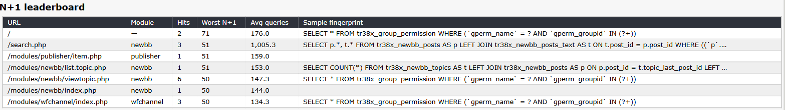

The value of the fingerprint column is visible in that example: a single `SELECT * FROM ..._group_permission WHERE gperm_name = ? AND gperm_groupid IN (?+)` is shown once with a worst repeat of 71, rather than as 71 statements that happen to differ by id.

**Reproduce with full logging, briefly.** Set Query Logging to **All queries**, reload the worst URL once, and set it straight back to **Slow & errors only**. In the **Queries** collector the repeats are marked `DUP` with an execution count.

**Read the call site, then open it.** The **Performance** panel's `N+1 candidates` and `Similar shapes` name the code that issued the repeats, as `file:line`, and those locations are clickable. That is normally where this investigation ends: you go straight from "this URL runs 62 identical queries" to the handler method responsible, without grepping for the statement.

**Confirm the shape.** An N+1 looks like one query that loads a list, followed by many near-identical queries that differ only in an id. The fix is a join, a bulk `IN (...)` lookup, or preloading through the handler — not caching the symptom.

**Check the plan for the ones that are genuinely slow.** Use the **EXPLAIN** action beside a recorded read-only query and look for full table scans, temporary tables, and filesorts. The client never sends SQL to the server for this: it references a statement the server already recorded, so the plan you see is for the statement that actually ran.

If **Recent budget violations** shows `query-errors`, stop and read those first. A failing query is never a performance question, and it is flagged regardless of any budget you configured.

### “The page works for me but fails intermittently”

Intermittent faults are rarely reproducible on demand, so collect rather than chase.

Set a realistic budget — request time or query count — so that a bad request records itself. When a budget is crossed, the **flight recorder** writes a bounded JSON record containing the request metrics, the decoded flags, the findings, the N+1 groups, and the slow queries for that request. Open **Analytics > Flight recorder** afterwards and read the record for the failure, rather than trying to reproduce it live.

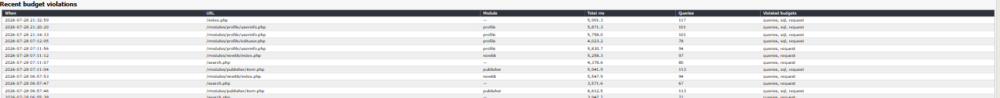

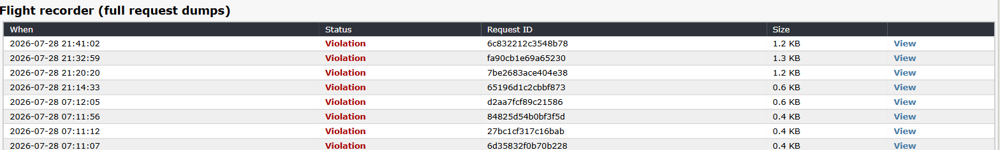

Cross-reference with **Logs**. Match the Monolog entry's timestamp and source location with the flight record's request id. Common causes that show up this way are cache-directory permissions that fail only for some users, a remote call that times out under load, and errors raised after a redirect has already been issued — which is exactly the case where nothing appears on screen.

### “The theme is missing content”

Enable **Smarty Debug** temporarily and open the **Smarty** collector on the affected page. Confirm the actual variable name, type, and structure before editing a template — most “missing content” is a template reading a variable that was never assigned, or assuming an array where a scalar was passed. Remember the `<{ ... }>` delimiters.

If the variable exists and is correct, the template you are editing is probably not the one being used. Enable **Collect template resolution** and open the **Templates** tab: it names the file that served each template — your theme override, the module's own copy, or the database — so the question is answered in one line instead of inferred from a list of hundreds of included files. A template you have overridden that still reports `module file` means XOOPS never saw your copy, which is usually a wrong directory or a wrong filename rather than anything wrong with the template itself.

**Diagnostics** verifies the configured theme directories and entry files independently.

Turn the preferences off afterwards. Smarty collection adds work on every request and exposes business data to any administrator, and template resolution is detail you only need while you are looking for it.

### “Where is the time going inside PHP?”

Reach for this when the timeline shows the time is in PHP rather than SQL, but not *which* PHP.

**Confirm that first, in one glance.** The **Performance** panel's `Time split` gives Boot, SQL and App for the request. If `App` is the largest, the time genuinely is in PHP and an Xdebug profile is the right next step. If `SQL` is largest you are in the wrong section — go back to "The database server is busy". Arming a profiler to discover you had a query problem wastes a capture and a lot of reading.

Configure Xdebug for trigger-based profiling, then arm one capture with **Profile this request** (see section 7). Open **Analytics > Xdebug profiles**, select the generated file, and read the top functions by cost. Two columns matter and they answer different questions:

- **Inclusive** cost includes everything a function called. A high inclusive cost near the top of the stack tells you which subsystem is expensive.
- **Self** cost excludes callees. A high self cost is the function actually burning the CPU.

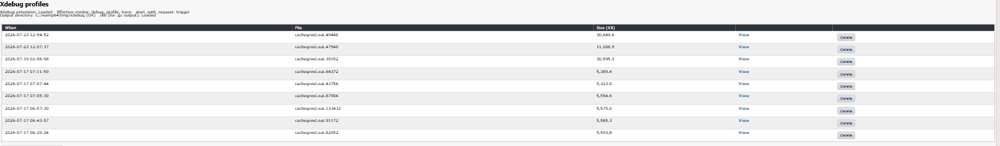

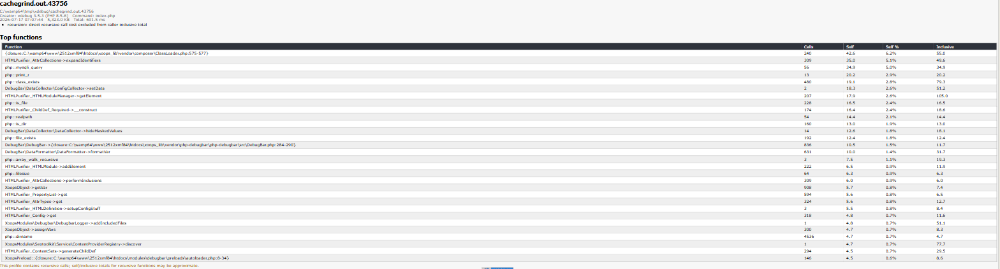

Both readings are visible in that example. `php::mysqli_query` has a self cost of 34.9 and an inclusive cost of 34.9 — identical, because it calls nothing else, so that time is genuinely spent in the database driver. `HTMLPurifier_ChildDef_Required->__construct` shows 17.9 self against 105.0 inclusive across 207 calls: the constructor itself is cheap and the expense is in what it triggers.

A function with high inclusive and low self cost is a router, not a bottleneck — follow its callees. A function with high self cost and a large call count is usually the real answer, and is often something cheap being called far too often.

If the header reports `too_large: file exceeds …` and Top functions is empty, the capture was bigger than the parser's size cap. Profile a narrower page, or open that file in QCacheGrind or KCacheGrind instead.

Cachegrind files are large. Delete them individually when finished, or use **Purge files older than 30 days**.

## 9. Finish safely

When testing is complete:

1. Turn **XOOPS Debug OFF** from DebugBar Home.
2. Turn off Ray, full query logging, Included Files, and unnecessary profiling options.
3. Review retention and delete obsolete Xdebug profiles.
4. Clear browser-local DebugBar history if it is no longer useful.
5. Never publish screenshots or logs without reviewing request data and paths. The Request Summary panel names the signed-in administrator and their user id, Analytics lists real URL paths, and a cachegrind profile contains absolute filesystem paths. The screenshots in this guide were reviewed on that basis before being committed.

Disabling the DebugBar preference does not enable or disable XOOPS Debug automatically. The two switches are intentionally separate so the administrator can use XOOPS debugging without the browser toolbar, or disable all diagnostic collection with the global XOOPS switch.

## Related guides

- [Extending XOOPS DebugBar](extending-debugbar.md)
- [Ray integration](ray-integration.md)
